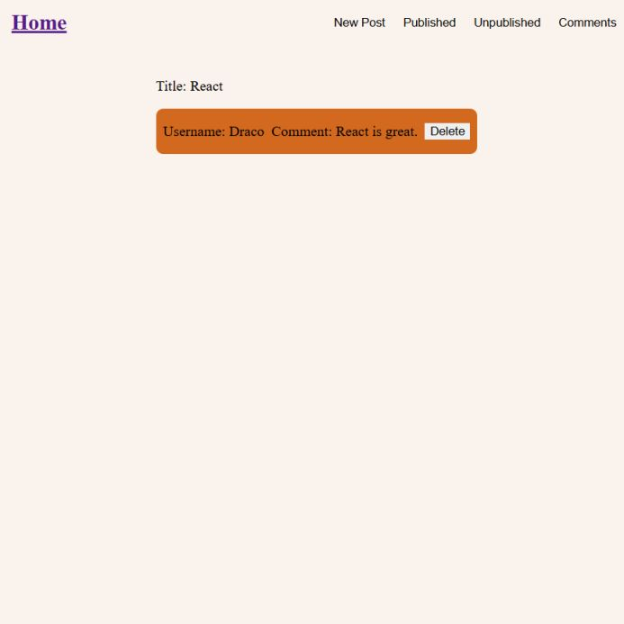

<div align='center'>

# Blog

</div>
<div align='center'>
    <h3>💻 Technologies</h3>
    
    
    
    
    
    
    
    
    
    
    
    
    
    
    
    
    
    <h4><a href="https://blog-users-dhof.onrender.com/"> Users Live Preview</a></h4>
    <h4><a href="https://blog-admin-6fh6.onrender.com/"> Admin Live Preview</a></h4>
</div>

<!-- **Demo:** -->

<!--  -->

<details>

**<summary>Users screen views</summary>**

**Desktop View:**


<br>

**Tablet View:**


<br>

**Mobile View:**


</details>

<details>

**<summary> Admin screen views</summary>**

**Desktop View:**


<br>

**Tablet View:**


<br>

**Mobile View:**


</details>

## 🌐 Origin

[The Odin Project](https://www.theodinproject.com/)

## 📝 Description

Users site sign up to make posts and Admins sign up to see and alter posts.

<details>
<summary>Features</summary>

- ###

</details>

## 🎯 Relevance

To solidify concepts of `APIs` in NodeJS.

## 👥 Intended Audience

Developers, users, and non-developers.

> [!NOTE]
> Users can install all dependencies using `package.json` file via:
>
> ```bash
> npm install
> ```
>
> To use `manageDeployments.sh`:
>
> ```bash
> sudo apt install gh
> gh auth login
> sudo apt-get install jq
> chmod +x manageDeployments.sh
> ./manageDeployments.sh
> ```

## 📂 Files

<details>
<summary>Invert</summary>

| File              | Description                                               |
| ----------------- | --------------------------------------------------------- |
| `admin-frontend`  | Admin project.                                            |
| `users-frontend`  | Users project.                                            |
| `backend`         | Server-side project.                                      |
| `readme-assets/*` | Live demo and different screen views used in `README.md`. |

</details>

## ©️ Credit

<details>
<summary>Invert</summary>

| File | Description |
| ---- | ----------- |

</details>

## 🔄 Improvements

<details>
<summary>Invert</summary>

- [ ] Improve UI
- [ ] Add timeout for login session

</details>

## 👤 Curator

1. [Ace Da Costa Silvanus](https://github.com/asdacosta)

**[🞁 Top](#blog)**
